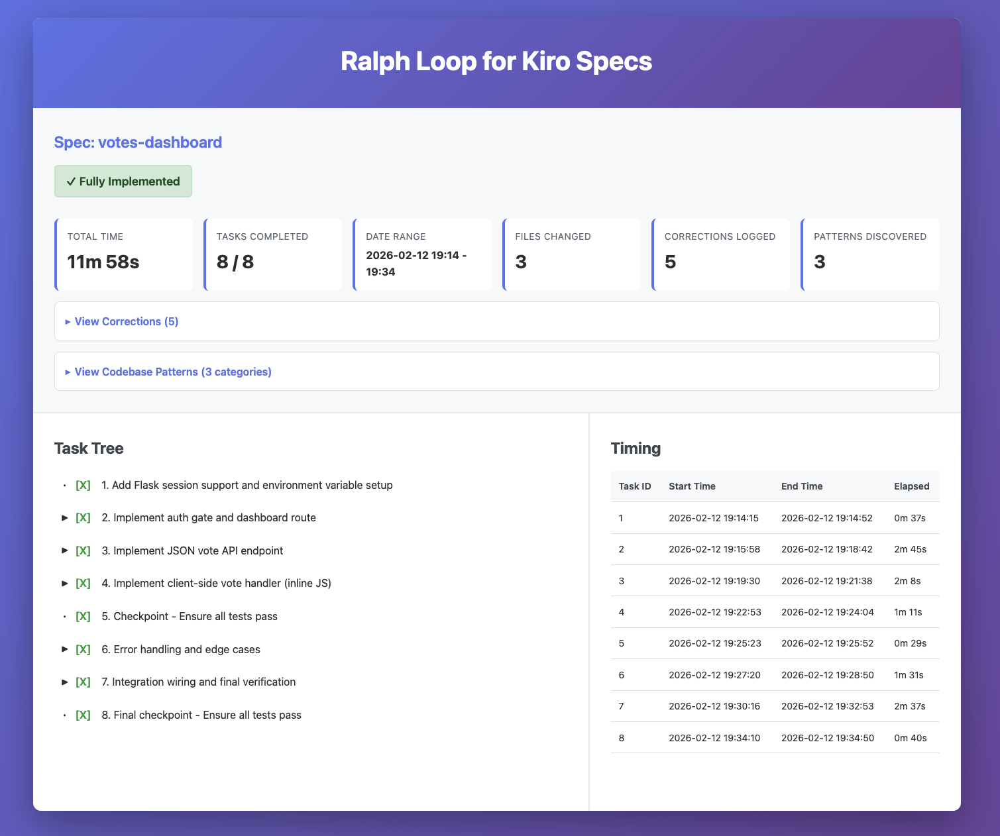

> This README was written by [Kiro](https://kiro.dev).

# Ralph Loop for Kiro Specs

Ralph Loop is an automated, iterative agent runner that drives spec-based development in [Kiro](https://kiro.dev). It wraps the `kiro-cli` in a bash loop, feeding it a carefully engineered prompt that turns Kiro into a disciplined, self-correcting implementation agent — one that picks up tasks from a spec, implements them, verifies its own work, and learns from its mistakes across iterations.

## Dashboard Example

When all tasks are complete, Ralph generates a self-contained `summary.html` dashboard:



## What is the Ralph Loop?

Most AI coding workflows are one-shot: you give the agent a prompt, it produces code, and you manually review and iterate. The Ralph Loop flips this model. Instead of a single prompt-response cycle, Ralph runs Kiro repeatedly in a loop — each iteration picks up exactly one task from a structured task list, implements it fully, verifies it against exit criteria, and records what it learned. The next iteration reads those learnings before starting its own task.

This creates a feedback loop where the agent:
- Never repeats a mistake it already made (corrections are logged and re-read every iteration)
- Follows patterns established by earlier iterations (codebase patterns are accumulated)
- Works through a spec methodically, task by task, in order
- Stops automatically when everything is done

## What are Kiro Specs?

Kiro Specs are a structured way of defining and implementing features in Kiro. A spec is a collection of markdown files that formalize the design and implementation process:

- **`requirements.md`** — Defines what needs to be built, broken into numbered requirements, each with specific exit criteria that must be satisfied before a task can be marked complete.
- **`design.md`** — Captures architecture decisions, component design, data models, API contracts, and any constraints the implementation must follow.
- **`tasks.md`** — A checklist of implementation tasks derived from the requirements and design. Tasks are numbered and can have subtasks. Each task references which requirements it fulfills. Tasks are marked `[X]` when complete or `[F]` when failed.

Specs live under `.kiro/specs/<specs_name>/` in your project. They give the agent (and your team) a shared, unambiguous definition of what "done" looks like for a feature.

Ralph Loop adds two more files to the spec directory at runtime:

- **`progress.md`** — A living document that accumulates corrections (mistakes to avoid), codebase patterns (conventions to follow), and chronological progress entries for each completed task.
- **`specs_time.md`** — A time log tracking start/end timestamps and elapsed time per task.

## How It Works

The script runs a loop where each iteration sends the Ralph prompt to `kiro-cli`. The prompt instructs the agent to follow a strict six-phase cycle:

### Phase 1: Load Context

Ralph reads your project's steering files and the target spec to understand the full picture:

| File | Purpose |
|---|---|
| `.kiro/steering/product.md` | What the product is |
| `.kiro/steering/structure.md` | Project structure conventions |
| `.kiro/steering/tech.md` | Tech stack and tooling |
| `.kiro/specs/<name>/requirements.md` | Requirements and exit criteria |
| `.kiro/specs/<name>/design.md` | Architecture and design decisions |
| `.kiro/specs/<name>/tasks.md` | The task list to implement |
| `.kiro/specs/<name>/progress.md` | Corrections, patterns, and past progress |

Ralph also takes stock of available tools in the environment (MCP servers, linters, test runners, etc.) and uses them when they'd genuinely help.

### Phase 2: Pick ONE Task

Ralph finds the lowest-numbered incomplete task in `tasks.md`, reads its referenced requirements and design details, and records the current time. It never picks more than one task per iteration — this keeps each cycle focused and reviewable.

### Phase 3: Understand Before Implementing

Before writing any code, Ralph:

1. Reads existing source files relevant to the task
2. Studies current patterns, naming conventions, and project structure
3. Re-reads the Corrections section — a lookup table of mistakes previous iterations already made and fixed — and applies every relevant correction proactively
4. Re-reads the Codebase Patterns section and follows any patterns relevant to the current task

This phase is what makes the loop self-correcting. If iteration 3 discovered that the project uses `npm run test:unit` instead of `npm test`, iteration 4 will know that before it even starts.

### Phase 4: Implement

Ralph implements the task and all its subtasks in order, following the project's existing conventions. After implementation, it runs typechecks and tests as applicable.

If something fails:
- Ralph fixes the issue
- Immediately asks: "Could a future iteration hit this same problem?"
- If yes, writes a correction to `progress.md` right away — not at the end of the task
- If the failure can't be resolved after 3 attempts, it's logged as an unresolved blocker and the task is marked `[F]` (failed)

### Phase 5: Verify Exit Criteria

Before marking a task complete, Ralph re-reads the exit criteria from `requirements.md` and the design constraints from `design.md`, confirming each one is satisfied. If anything is missing, it goes back and addresses it.

### Phase 6: Update Tracking

Ralph wraps up the iteration by:

1. Marking the task `[X]` in `tasks.md`
2. Appending a structured progress entry to `progress.md` (what was implemented, files changed, tools used, patterns discovered, corrections added)
3. Adding any new reusable codebase patterns to the Codebase Patterns section
4. Doing a final sweep for any errors not yet logged as corrections
5. Recording timing to `specs_time.md`

## The Self-Correction System

The Corrections section at the top of `progress.md` is one of Ralph's most important features. It's a flat lookup table of mistakes and their fixes, written in a scannable format:

```
- ❌ `python manage.py migrate` → ✅ `python3 manage.py migrate` (system has no `python` alias)
- ❌ `import { foo } from 'lib'` → ✅ `import { foo } from 'lib/index.js'` (ESM requires explicit extensions)
- ❌ Running tests with `npm test` → ✅ `npm run test:unit` (project uses separate test scripts)
- ❌ UNRESOLVED: [description of issue that couldn't be fixed after 3 attempts]
```

Good corrections include wrong CLI commands, missing flags or env vars, import path issues, API misuse, file naming mistakes, platform-specific gotchas, and any assumption that turned out to be false.

Every iteration reads this section before doing any work and must never repeat a listed mistake.

## Codebase Patterns

Ralph also accumulates a Codebase Patterns section in `progress.md` — conventions and patterns discovered during implementation that future iterations should follow. These span categories like:

- Project structure and module organization
- Language idioms and type system conventions
- Error handling patterns
- Data, state, and API patterns
- Frontend/UI conventions
- Testing conventions
- Build and tooling specifics

Only patterns actually encountered during implementation are recorded — Ralph doesn't try to fill these out speculatively.

## Completion and Summary

When all tasks in `tasks.md` are marked `[X]`, Ralph generates a self-contained `summary.html` file in the spec directory. This is a single HTML page (inline CSS/JS, no external dependencies) with:

- A top pane showing the spec name, overall status (green for all complete, red for any failures), total elapsed time, task count, and date range
- A left pane with a collapsible task tree where hovering over any task shows its progress details (what was implemented, files changed, tools used, patterns, corrections)
- A right pane with a timing table showing per-task start/end times and durations

## Prerequisites

- [Kiro CLI](https://kiro.dev/cli/)(`kiro-cli`) and [Kiro IDE](https://kiro.dev/) installed and available on your `PATH`
- A Kiro project with specs set up under `.kiro/specs/<specs_name>/`
- Bash shell

## Project Structure

```
your-project/
├── ralph-loop-kiro-specs-prompt.md    # The Ralph agent prompt template
├── ralph-loop-kiro-specs-script.sh    # The loop runner script
└── .kiro/
    ├── steering/
    │   ├── product.md                 # What the product is
    │   ├── structure.md               # Project structure conventions
    │   └── tech.md                    # Tech stack and tooling
    └── specs/
        └── <specs_name>/
            ├── requirements.md        # Requirements and exit criteria
            ├── design.md              # Architecture and design decisions
            ├── tasks.md               # Task checklist
            ├── progress.md            # Auto-created: corrections, patterns, progress log
            ├── specs_time.md          # Auto-created: per-task timing
            └── summary.html           # Auto-generated on completion: visual dashboard
```

## Usage

```bash
./ralph-loop-kiro-specs-script.sh <max_iterations> <specs_name>
```

| Argument | Description |
|---|---|
| `max_iterations` | Maximum number of loop iterations (positive integer). Each iteration implements one task. |
| `specs_name` | Name of the spec directory under `.kiro/specs/`. Must already exist with at least `requirements.md`, `design.md`, and `tasks.md`. |

### Example

```bash
# Run up to 15 iterations on the "auth-feature" spec
./ralph-loop-kiro-specs-script.sh 15 auth-feature
```

### What Happens When You Run It

1. The script validates that `max_iterations` is a positive integer and `specs_name` points to an existing spec directory
2. It initializes `progress.md` and `specs_time.md` if they don't already exist
3. It loads the prompt template and substitutes `SPECS_NAME` with your spec name
4. It displays the full prompt for your review
5. It asks whether you want to iterate automatically or pause between iterations (manual mode lets you review changes after each task)
6. Each iteration pipes the prompt to `kiro-cli chat --trust-all-tools --no-interactive` and streams output to stderr so you can watch in real time
7. If the agent outputs `<promise>COMPLETE</promise>`, the loop exits successfully
8. If max iterations are reached without completion, the script exits with a warning

### Iteration Modes

- **Automatic** — Ralph runs through tasks back-to-back without pausing. Good for well-defined specs where you trust the process.
- **Manual** — Ralph pauses after each iteration and waits for you to press Enter. Good for reviewing changes incrementally or when working on a new/unfamiliar spec.

## Tips

- Set `max_iterations` to at least the number of tasks in your spec, plus a buffer for potential retries on failed tasks
- Review `progress.md` between iterations (especially in manual mode) to see what Ralph learned and whether corrections look reasonable
- If Ralph gets stuck on a task (marked `[F]`), you can fix the issue manually, update `tasks.md`, and re-run
- The steering files (`product.md`, `structure.md`, `tech.md`) significantly improve Ralph's output — the more context you provide about your project, the better the implementations will be

## License

Apache License 2.0 — see [LICENSE](LICENSE) for details.
